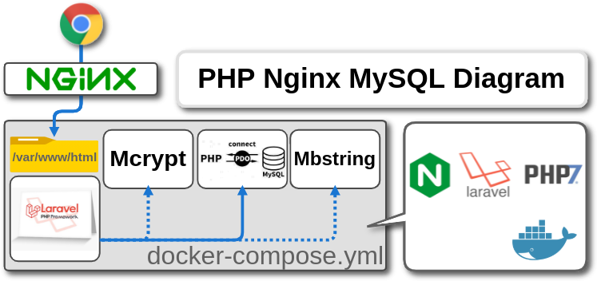

### Dockerized PHP7.4.23-FPM



### Status


### Table of contents
* [Prerequisites](#Prerequisites)
* [Project Tree](#Project-Tree)
* [Backup Folder](#Backup-Folder)
* [Config Folder](#Config-Folder)
* [Deployment](#Deployment)

The use of PHP-7.4.23 integrated Nginx-1.18 is based on  [dockerized-lemp-php5.6-fpm](https://github.com/eduardsaryan/dockerized-lemp-php5.6-fpm) modification

### Prerequisites
*	[Connect to the Internet](http://www.brandx.net/support/dsl/quickstart/dsl-quickstart.html)
*	[Docker](https://www.docker.com/)
*	[Docker Compose](https://docs.docker.com/compose/install/)
*	[php artisan key:generate](https://github.com/laravel/framework/issues/20719)

### Project Tree
```less
├── .env.db
├── .env.web
├── docker-compose.yml
├── Dockerfile
├── backup
|   ├── db
|   |   └── (bak-list)  
│   ├── db_backup.sh
│   ├── db_restore.sh
|   ├── init.sql
|   ├── web
|   |   └── (bak-list)
│   ├── web_backup.sh
│   └── web_restore.sh
├── conf
|   ├── docker.cnf
|   ├── fpm.conf
|   ├── php.ini
|   ├── supervisord.conf
│   └── website.conf
├── docker-compose.yml
├── webapp
|   └── public
|       ├── favicon.ico
|       └── index.php      
└── webinfo
    └── index.php
```

### Backup Folder
| File                        | Description                                                           |
| :-------------------------- |:--------------------------------------------------------------------- |
| db_backup.sh                | (Perform daily backups and delete backup files older than 10 days.)   |      
| db_restore                  | Small script to backup web Folder                                     |
| init.sql                    | MySQL-Database initialization schema
| web_backup.sh               | Small script to restore MySQL database                                |
| web_restore.sh              | Small script to restore web Folder                                    |

### Config Folder
| File                        | Description                                                                          |
| :-------------------------- |:------------------------------------------------------------------------------------ |
| docker.cnf                  | mysql-server config ( If there are changes, you must docker-compose build. )
| fpm.conf                    | Custom PHP-FPM config                                                                |
| php.ini                     | For additional configurations of PHP, еdit this file before deploying the container. |  
| supervisord.conf            | supervisord.conf basic config                                                        |
| website.conf                | Nginx basic config file.                                                             |

### Deployment
Clone repo to your server. I suggest using ```/opt``` directory
```less
sudo git clone https://github.com/jameshue/exercise-php-nginx-mysql.git
```

Put your WEB-Application into the ```webapp``` folder. <br>
Navigate to the project folder and start containers.

```less
cd /path/to/exercise-php-nginx-mysql
docker-compose up -d
cp backup/init.sql db/
docker exec -it webapp-db bash
cd /var/lib/mysql
mysql -uroot -ppassword
\. init.sql


```
